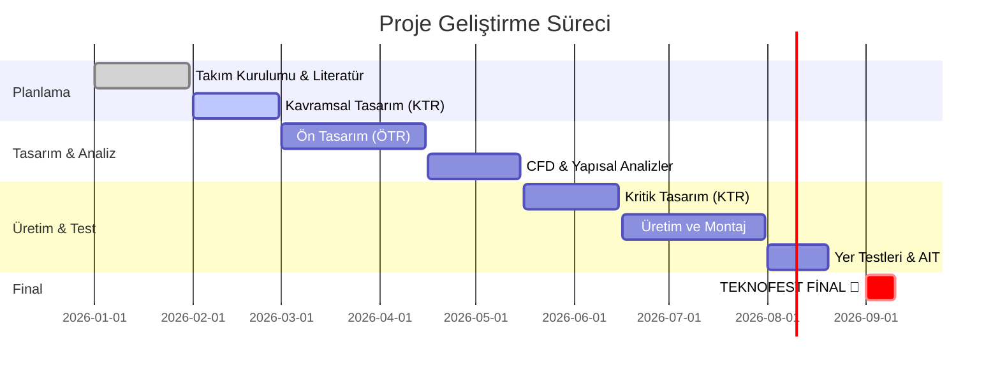

# 🚀 Teknofest 2026 Yüksek İrtifa Roket Projesi

  

   

  
  
  
  
  

   

  ### *"Göklerdeki istikbalimiz için planlı, disiplinli ve bilimsel çalışma."*
  
  **Bahattin Yunus** | *Kişisel Portföy Projesi*

---

## 🌌 Vizyon ve Amaç (Mission Statement)

Bu proje, sadece bir roket tasarlamak değil; **havacılık ve uzay mühendisliği** disiplinlerinin sınırlarını zorlayan, yüksek teknolojili ve özgün bir sistem geliştirmektir. 
**10.000 feet (3.000m)** irtifaya ulaşmayı ve güvenli bir şekilde yere inmeyi hedefleyen bu roket, kişisel mühendislik yetkinliklerimin ve tutkumun bir nişanesidir.

> **Hedef:** Yüksek irtifa, kusursuz aviyonik sistemler ve özgün mekanik tasarım.

---

## 🛠️ Teknoloji Yığını (Tech Stack)

Projede kullanılan araçlar ve teknolojiler, endüstri standartlarına uygun olarak seçilmiştir.

| Bölüm | Araçlar & Teknolojiler |
| :--- | :--- |
| **🚀 Tasarım & Simülasyon** |    |
| **⚡ Aviyonik & Gömülü** |    |
| **💻 Yazılım & Analiz** |    |
| **📊 Yönetim & Dokümantasyon** |    |

---

## 🗺️ Yol Haritası ve Süreç (Timeline)

2026 Teknofest finaline giden yolda kritik kilometre taşları:

---

## 📚 Kaynaklar ve Arşiv (Knowledge Base)

Bu depo, projenin **hafızasıdır**. Aşağıdaki bağlantılardan detaylı teknik dokümanlara ulaşabilirsiniz.

*   📂 **[Teknik Dokümantasyon](docs/)**
    *   [🔥 İtki Sistemi (Propulsion)](docs/subsystems/propulsion.md)
    *   [⚡ Aviyonik & Yazılım](docs/subsystems/avionics.md)
    *   [🏗️ Yapısal & Mekanik](docs/subsystems/structure.md)
    *   [🪂 Kurtarma Sistemi (Recovery)](docs/subsystems/recovery.md)
*   📋 **[Operasyonel Kontrol Listeleri](docs/operations/)**
*   📊 **[Geçmiş Raporlar & Analizler](geçmis_raporlar/)**

---

## 🌟 Katkıda Bulunma ve İletişim

Bu proje açık kaynak felsefesini destekler. Önerilerinizi ve katkılarınızı bekliyorum.

 

  
Made with ❤️ and 🚀 by Bahattin Yunus

  
© 2026 All Rights Reserved

