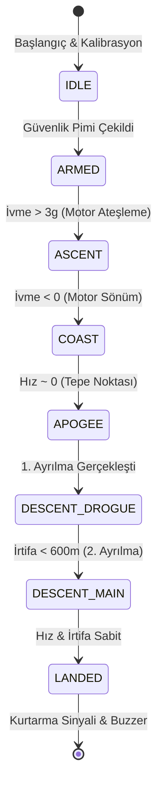

# ⚡ Aviyonik ve Gömülü Sistemler (Avionics & Embedded Systems)

  
  
  

## 🎯 Sistem Özeti
Bu modül, roketin "beyni" olarak işlev görür. Uçuş verilerini toplar, analiz eder ve kritik kararları (paraşüt açma vb.) milisaniyeler içinde verir.
**Ana Hedef:** Çift yedekli (Redundant) sistem mimarisi ile %99.9 güvenilirlik sağlamak.

---

## 💻 Donanım Mimarisi (Hardware Architecture)

Uçuş bilgisayarımız, yüksek performanslı **STM32F4** serisi mikrodenetleyiciler üzerine kuruludur.

### 🧩 Bileşen Seçimi (Component Selection)

| Bileşen | Model | Açıklama | Neden Seçildi? |
| :--- | :--- | :--- | :--- |
| **Ana İşlemci (MCU)** | **STM32F407VGT6** | 168 MHz, Cortex-M4F | Yüksek işlem gücü, FPU (Kayan Nokta Birimi) desteği ve zengin çevre birimleri. |
| **IMU (İvme/Jiroskop)** | **BNO055** | 9-Eksenli Mutlak Yönelim | Dahili sensör füzyonu işlemcisi ile CPU yükünü azaltır. |
| **Barometre (Altimetre)** | **MS5611** | 24-bit ADC, I2C | 10cm hassasiyet ile dikey hız ve irtifa ölçümü için endüstri standardı. |
| **GPS (Konum)** | **u-blox NEO-M8N** | GNSS, UART | Yüksek güncelleme hızı (10Hz) ve hassas konumlandırma. |
| **Telemetri (LoRa)** | **Ebyte E32-433T30D** | 433 MHz, 1W | 8km+ menzil, yüksek parazit direnci ve güvenilir veri aktarımı. |
| **Veri Kaydı (Storage)** | **MicroSD Kart** | SPI Arayüzü | 50Hz hızında uçuş verisi, sensör ham verisi ve durum loglarını kaydeder. |

---

## 📡 Yazılım Mimarisi (Software Architecture)

Yazılım, **Real-Time Operating System (FreeRTOS)** veya **Bare-Metal Scheduler** üzerinde koşan olay tabanlı bir yapıdadır.

### 🔄 Uçuş Durum Makinesi (Finite State Machine)
Roket, sensör verilerine dayanarak aşağıdaki durumlar arasında geçiş yapar:

### 🧠 Algoritmalar

#### 1. Sensör Füzyonu (Extended Kalman Filter - EKF)
Ham sensör verileri gürültülüdür. **Kalman Filtresi**, Barometre ve İvmeölçer verilerini birleştirerek roketin gerçek durumunu (konum, hız, yönelim) mümkün olan en yüksek doğrulukla tahmin eder.
*   **Barometre:** Uzun vadeli irtifa doğruluğu sağlar (Drift yok).
*   **İvmeölçer:** Hızlı hareketleri yakalar (Gürültü az).

#### 2. Apogee Tespiti (Tepe Noktası)
Sadece barometre verisine güvenmek yerine, hız vektörünün yön değiştirdiği (pozitiften negatife döndüğü) an, Kalman Filtresi çıkışı ile tespit edilir. Bu, erken veya geç ateşlemeyi önler.

---

## ⚡ Güç Yönetimi ve Şema

Sistem, 2 adet LiPo pil ile beslenir:
1.  **Lojik Güç (2S 7.4V):** Regüle edilerek işlemci ve sensörleri besler.
2.  **Piroteknik Güç (3S 11.1V):** Doğrudan MOSFET'ler üzerinden barut ateşleyicileri (E-Match) besler.

### 🔌 Pinout Tablosu

| STM32 Pin | Fonksiyon | Bağlantı |
| :--- | :--- | :--- |
| **PA9/PA10** | UART1 TX/RX | Telemetri Modülü |
| **PB6/PB7** | I2C1 SCL/SDA | IMU & Barometre |
| **PA2/PA3** | UART2 TX/RX | GPS Modülü |
| **PC10/PC11** | SPI3 SCK/MOSI | SD Kart Modülü |
| **PD12** | GPIO Output | Buzzer |
| **PE9** | ADC Input | Batarya Voltaj İzleme |
| **PE13** | GPIO Output | Drogue Paraşüt MOSFET |
| **PE14** | GPIO Output | Main Paraşüt MOSFET |

---

## 🚨 Güvenlik Önlemleri (Failsafes)

1.  **Watchdog Timer:** Yazılım kilitlenirse sistemi otomatik yeniden başlatır.
2.  **Brown-out Reset:** Voltaj kritik seviyenin altına düşerse işlemciyi güvenli moda alır.
3.  **Mechanical Arming:** Fiziksel bir güvenlik anahtarı (Remove Before Flight) olmadan piroteknik kanallara asla enerji gitmez.
4.  **CRC Check:** Telemetri verileri CRC-16 ile doğrulanır, bozuk paketler reddedilir.
